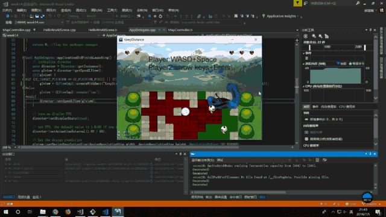
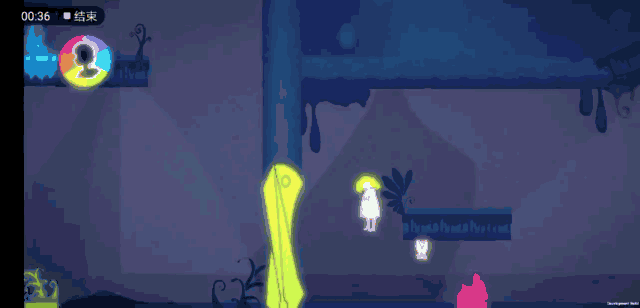
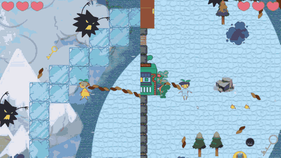

# 所有游戏展示

## VRGame 2019
unity3d和steamVR2.2制作的vR游戏。模仿节奏地牢以及雨中冒险，依靠节拍器驱动世界，人物根据手臂挥动的姿势得到相应的输入，从来移动，根据手柄的按键射击，具有一定的RPG元素。
[项目代码](https://github.com/kotomineshiki/RebellionRobert/tree/master/RRR)

## KeepDistance 2018.06
cocos2d制作的2D双人竞技游戏。两个玩家通过释放技能占领方格并改变颜色，在自己的领域内，移动速度加成，在敌方领域内，移动速度减少。玩家所在的区域被敌方玩家占领的一瞬间视为被攻击，玩家被击退一格并扣除血量。
[项目代码](https://github.com/yaoxh6/cocosFinal)

## Mariko 2018.11
unity3d开发的2D平台颜色解谜游戏。腾讯功能游戏开发比赛项目。人物利用头发发射子弹，相反的颜色会打倒怪物，其他颜色会粘在怪物上面。怪物和主人公可以穿过同样颜色的门，不同的颜色可以组合成新的颜色，一共可以储存三种颜色，所有的颜色信息都可以调出色轮查看。[项目代码](Github：https://github.com/spatulaG/NOTserious)

## 安全绳 2019.01
unity3d开发的2D双人合作游戏。2019年Global Game Jam项目。游戏双方用绳索相连，双方可以通过捡绳子增加移动范围，通过合作躲避毒气怪物，或者获得道具帮助另一边解密，最后双方都拿到钥匙打开一扇门获得成功。[项目代码](https://github.com/kotomineshiki/2019GGJ。)

## 解字 2018.03

unity3d开发的2D游戏。完美世界广州站Gamejam作品。在界面底部有不断出现简单字，通过点击简单字可以组合成复杂字，实现不同的效果。随着时间，底部会有白色遮挡物增长，挡住简单字，增加游戏难度，当简单字被完全遮挡，那么游戏结束。合成字的时候会有不同的特效，给予敌人攻击或者减少底部遮挡物。[项目代码](https://github.com/DaddyTrap/JieZi)

*注：完整视频文件放在mp4文件夹下*